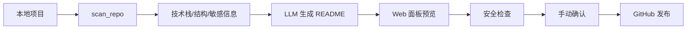

# 📦 DSH Portfolio Publisher

> **DeepSeek Harness 插件：GitHub 求职仓库一键发布助手**
>
> 扫描本地项目 → LLM 生成专业 README → 安全检查 → Web 可视化面板 → 一键推送 GitHub。

[](https://github.com/deepseek-ai/deepseek-harness)
[](https://github.com/xjailll/dsh-portfolio-publisher/releases)
[](LICENSE)
[](https://www.typescriptlang.org/)
[](https://nodejs.org/)
[](https://github.com/xjailll/dsh-portfolio-publisher/pulls)

---

## 🧭 这个插件解决什么问题

很多开发者做完项目后，不知道怎样把 GitHub 仓库整理成“面试官爱看的作品集”：

- README 写得太简单，像临时占位符；
- 项目里残留 AppID、Token、本地绝对路径等敏感信息；
- 不会初始化 Git / 创建 GitHub 仓库 / 推送；
- 没有可视化界面，操作全靠命令行。

`dsh-portfolio-publisher` 把这一整套流程变成 DSH 插件：

```text
扫描仓库 → 识别技术栈 → LLM 生成 README → 安全检查 → 预览 → 确认 → 推送 GitHub
```

---

## ⚡ 快速开始

### 1. 安装插件

```bash
# 将插件目录放到你的 DSH 插件目录中
dev_inject_plugin /path/to/dsh-portfolio-publisher
```

### 2. 打开 Web 面板

```text
http://127.0.0.1:3080/portfolio
```

### 3. 发布第一个仓库

1. 填写项目根目录；
2. 点击 `🔍 扫描`；
3. 点击 `📝 生成 README` 并预览；
4. 点击 `🛡️ 安全检查`；
5. 填写仓库名 / GitHub 用户名；
6. 点击 `🚀 发布到 GitHub`，确认后完成。

---

## ✨ 核心功能

| 功能 | 说明 |
| --- | --- |
| 🔍 仓库扫描 | 自动识别技术栈、目录结构、依赖、README/License/Git 状态、敏感信息 |
| 📝 LLM 生成 README | 基于 DSH LLM 生成专业、真实、有说服力的作品集 README |
| 🧠 自定义提示词 | 支持按项目/岗位/语气自定义生成要求 |
| 🛡️ 安全检查 | 扫描 AppID、Token、Secret、云环境 ID、本地绝对路径、AK/SK |
| 🖥️ Web 面板 | 内置 `/portfolio` 可视化面板，无需额外前端项目 |
| 🚀 一键发布 | 支持有/无 `gh` CLI 两种发布路径 |
| 👤 自动 Git 身份 | 没有本地 Git 身份时，自动使用 GitHub 用户名兜底 |

---

## 🔄 工作原理



### 数据流

1. `scan_repo` 读取项目目录、`package.json`、Git 状态和常见敏感信息；
2. `generate_readme` 把扫描结果交给 DSH LLM，按专业 README 提示词生成 Markdown；
3. `sanitize_check` 输出泄露点报告；
4. `github_init` 自动配置 Git 身份、初始化仓库、创建 GitHub 仓库并推送。

---

## 🧩 插件工具

| 工具 | 说明 |
| --- | --- |
| `scan_repo` | 扫描项目，输出技术栈、结构、README/License/Git、敏感信息 |
| `generate_readme` | 基于 LLM 生成专业 README，支持自定义提示词 |
| `sanitize_check` | 检查 AppID / Token / Secret / 云环境 ID / 本地路径泄露点 |
| `github_init` | 初始化 Git、创建 GitHub 仓库并推送 |

### 工具调用示例

```text
scan_repo(root="D:/projects/my-project")
```

```text
generate_readme(
  root="D:/projects/my-project",
  description="社区服务全栈项目",
  author="Your Name",
  repo="https://github.com/your-name/my-project",
  prompt="突出全栈能力，重点写系统架构和数据库设计",
  overwrite=true
)
```

```text
sanitize_check(root="D:/projects/my-project")
```

```text
github_init(
  root="D:/projects/my-project",
  repoName="my-project",
  username="your-github-username",
  gitName="Your Name",
  gitEmail="you@example.com",
  visibility="public",
  commitMessage="feat: 初始化项目"
)
```

---

## 🖥️ Web 面板

插件注入后，浏览器访问：

```text
http://127.0.0.1:3080/portfolio
```

### 面板能力

- 多仓库批量扫描
- README 浏览器预览
- 泄露点可视化列表
- 手动确认后发布 GitHub
- 支持自定义 README 提示词
- 支持 Git 提交姓名 / 邮箱配置

### Web API

| 方法 | 路径 | 说明 |
| --- | --- | --- |
| GET | `/portfolio` | 可视化面板 |
| POST | `/portfolio/api/scan` | 扫描仓库，返回结构化结果 |
| POST | `/portfolio/api/readme` | LLM 生成 README |
| POST | `/portfolio/api/sanitize` | 返回敏感信息列表 |
| POST | `/portfolio/api/push` | 执行 Git/GitHub 发布 |

---

## 🧠 README 自定义提示词

默认提示词已经比较专业，但你可以覆盖：

| 方式 | 说明 |
| --- | --- |
| 工具参数 `prompt` | 单次生成时指定 |
| Web 面板文本框 | 可视化填写 |
| 插件配置 `readmePrompt` | 全局默认提示词 |

### 示例

```text
突出我的全栈能力，重点写系统架构和数据库设计，语气专业克制。
可以适当使用 Mermaid 架构图，不要写空话。
```

```text
用英文写 README，面向海外技术团队，突出工程化和测试覆盖。
```

---

## ⚙️ 插件配置

| 配置项 | 类型 | 默认值 | 说明 |
| --- | --- | --- | --- |
| `defaultVisibility` | `string` | `public` | 创建 GitHub 仓库时的默认可见性 |
| `panelPath` | `string` | `/portfolio` | Web 面板访问路径 |
| `readmePrompt` | `string` | `''` | 全局默认 README 自定义提示词 |

---

## 🔒 安全检查与脱敏建议

`sanitize_check` 会输出类似报告：

```text
⚠️ 发现 5 处潜在敏感信息：

📄 admin-web/src/stores/user.js
  - [疑似 Secret/Token] 第 20 行

📄 docs/QUICK_REFERENCE.md
  - [本地绝对路径] 第 9 行
```

建议在公开仓库前：

1. 将真实 AppID / Secret / 云环境 ID 替换为占位符；
2. 删除本地绝对路径；
3. 检查 `.env` 是否被 Git 跟踪；
4. 使用 `.gitignore` 排除 `node_modules`、`.env`、密钥文件；
5. 重新运行 `sanitize_check` 确认无泄露。

---

## 📂 项目结构

```text
dsh-portfolio-publisher/
├── src/
│   └── index.ts              # 插件主入口（工具 + Web 路由）
├── scripts/
│   ├── build.sh              # DSH 构建脚本
│   ├── test-tools.mjs        # 自动化测试
│   ├── create-gh-repo.mjs    # 通过本地 GitHub 凭据创建仓库
│   ├── release-gh.mjs        # 创建 Release
│   └── upload-asset.mjs      # 上传 Release 资产
├── lib/                      # 编译产物
├── package.json
├── tsconfig.json
└── README.md
```

---

## 🛠️ 开发与构建

### 环境要求

- Node.js 18+
- DeepSeek Harness 环境
- TypeScript

### 构建

```bash
DSH_CHECKOUT=<checkout> bash scripts/build.sh
```

### 注入

```bash
# 请替换为插件解压后的真实目录
dev_inject_plugin /path/to/dsh-portfolio-publisher
```

### 测试

```bash
node scripts/test-tools.mjs
```

测试覆盖：

- 4 个工具注册
- Web 路由注册
- 真实项目扫描
- README 生成
- 敏感信息检查
- GitHub 发布安全分支
- Web API 接口

---

## ❓ 常见问题

### 1. 没有安装 gh CLI 能发布吗？

可以。

- 已有 remote → 直接 `git push`；
- 没有 remote 但有 GitHub 用户名 → 自动添加 remote 并尝试推送；
- 仓库不存在 → 返回手动创建步骤。

### 2. LLM 不可用时怎么办？

`generate_readme` 会自动回退到内置 README 模板，不会报错。

### 3. 如何避免误操作推送？

Web 面板的“发布到 GitHub”按钮会弹出确认框，确认后才会执行 git/gh 操作。

### 4. 支持私有仓库吗？

支持。`github_init` 的 `visibility` 参数可传 `private`。

### 5. 如何批量扫描多个项目？

Web 面板的项目根目录输入框支持多行，每行一个路径，点击扫描会逐个处理。

---

## 🚀 路线图

- [x] 仓库扫描
- [x] LLM 生成 README
- [x] 自定义提示词
- [x] Web 可视化面板
- [x] 无 gh CLI 发布
- [ ] 自动脱敏替换（不只报告，直接替换占位符）
- [ ] GitHub Topics 自动推荐
- [ ] 多仓库批量发布队列
- [ ] README 多语言生成（中 / 英）
- [ ] Release 自动创建

---

## 📄 License

[BSD-3-Clause](LICENSE)

---

## 🙌 相关链接

- [DeepSeek Harness](https://github.com/deepseek-ai/deepseek-harness)
- [Releases](https://github.com/xjailll/dsh-portfolio-publisher/releases)
- [Issues](https://github.com/xjailll/dsh-portfolio-publisher/issues)
